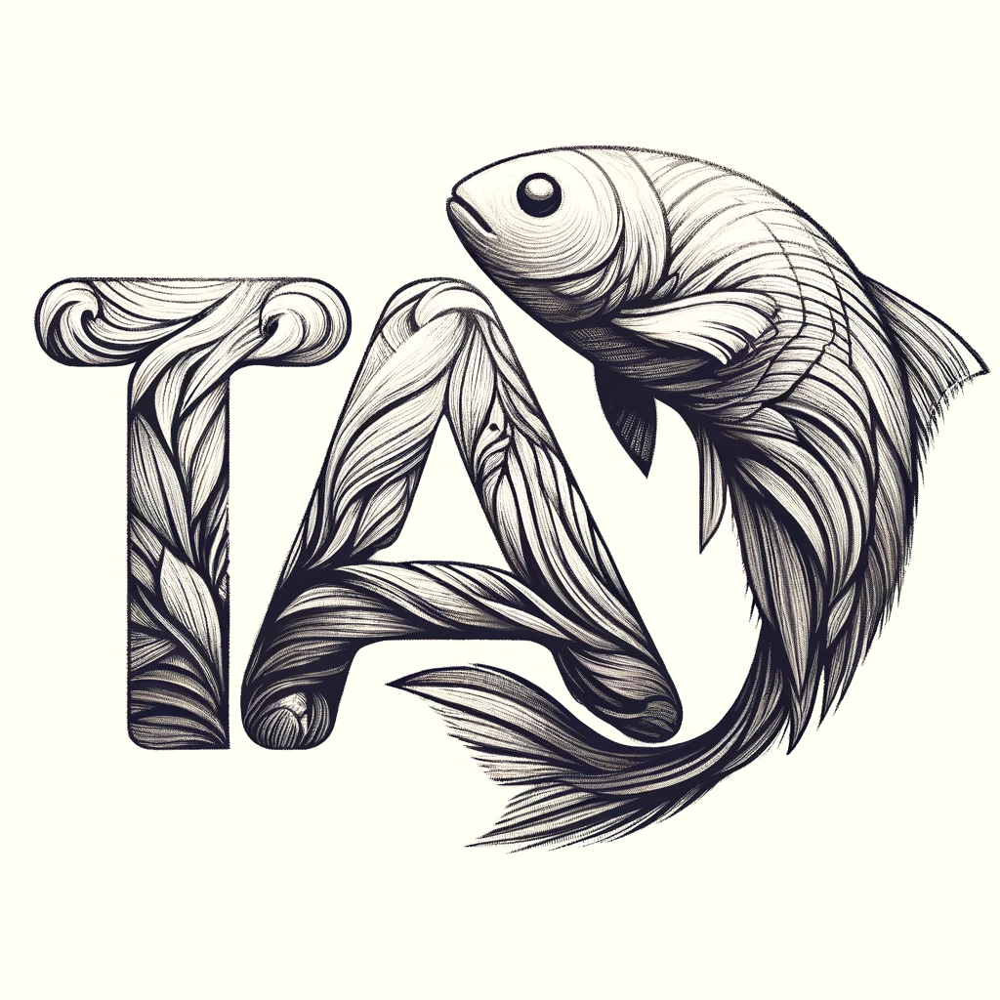

# TAI: Teaching Assistant Intelligence



[](https://www.python.org/downloads/)
[](https://python-poetry.org/)
[](https://github.com/psf/black)

## 🚀 Quick Start

Get TAI running with just two commands:

```bash
# Install Poetry if you haven't already
curl -sSL https://install.python-poetry.org | python3 -

# Setup everything
make setup
```

Start the backend service:

```bash
make dev-backend
```

Visit `http://localhost:8000` to see the API documentation. 🎉

## 🔄 Automatic Environment Activation

TAI includes a `.envrc` file that automatically activates the Poetry environment when you enter the directory. To enable this:

### Using direnv (Recommended)

1. **Install direnv:**

   ```bash
   # On macOS with Homebrew
   brew install direnv

   # On Linux with apt
   sudo apt install direnv
   ```

2. **Add direnv hook to your shell:**

   **For zsh:**

   ```bash
   echo 'eval "$(direnv hook zsh)"' >> ~/.zshrc
   source ~/.zshrc
   ```

   **For bash:**

   ```bash
   echo 'eval "$(direnv hook bash)"' >> ~/.bashrc
   source ~/.bashrc
   ```

3. **Allow the .envrc file:**
   ```bash
   cd /path/to/TAI/tai
   direnv allow
   ```

Now whenever you `cd` into the `tai` directory, your Poetry environment will automatically activate! You'll see:

```
🐍 Activating Poetry environment: TAI-xyz123
direnv: loading .../TAI/tai/.envrc
```

## Link to Website

https://tai.berkeley.edu

## What is TAI?

TAI is an open source project developed by researchers and students at UC Berkeley (see Credits below), with the goal to offer the power of edge GPT models and services for education purposes. The GPT models selected in TAI are carefully curated to allow students to easily spin up their own local GPT services and websites. The project further develops robust embedding and RAG toolkits to allow users to convert their knowledge base and multimedia documents into searchable vector databases.

Once installed locally, TAI allows individuals to easily start a conversation to use GPT techniques to search through local documents using simple natural languages.

## 🏗️ Architecture

TAI is organized as a monorepo with the following components:

```
tai/
├── 🚀 ai_course_bot/ai_chatbot_backend/  # FastAPI backend service
├── 🧠 rag/                              # RAG pipeline and file processing
├── 📁 rag/file_organizer/               # File organization utilities
└── 📊 evaluation/dataset_generate/      # Evaluation and dataset tools
```

## 💻 Development Workflow

### Available Commands

```bash
# Installation
make install-all          # Install all components
make install-backend      # Install only backend
make install-rag          # Install only RAG pipeline

# Development
make dev-backend          # Start backend service
make dev-rag             # Start RAG tools

# Testing & Quality
make test-all            # Run all tests
make lint-all            # Lint all code
make format-all          # Format all code
make clean-all           # Clean artifacts

# Status & Help
make help                # Show all commands
```

### Working with Components

```bash
# Work with specific components
make backend TASK=test      # Run backend tests
make rag TASK=lint         # Lint RAG code
make organizer TASK=format # Format organizer code
```

## 📦 Package Management

TAI uses Poetry for modern dependency management. Each component has isolated dependencies.

### Adding New Packages

```bash
# Navigate to component and add packages
cd ai_course_bot/ai_chatbot_backend
make add PKG=torch                    # Add production dependency
make add-dev PKG=pytest              # Add development dependency
make remove PKG=outdated-package     # Remove package
make update                          # Update dependencies
```

Poetry automatically updates `pyproject.toml` and `poetry.lock` files - no more manual requirements.txt editing!

## 🧪 Testing

```bash
# Run all tests
make test-all

# Component-specific testing
cd ai_course_bot/ai_chatbot_backend && make test
cd rag && make test
```

## 🔧 Troubleshooting

### Poetry Issues

```bash
# Install Poetry
curl -sSL https://install.python-poetry.org | python3 -

# Reset environment
poetry cache clear pypi --all
make clean-all && make install-all
```

### Python Version

Requires Python 3.10+. Check with `python --version`.

### Useful extension

`ms-python.black-formatter` is the formatter extension the project use.

Copy the json below into your `.vscode/settings.json` to make code formatting and style aligned.

```JSON
{
    "editor.formatOnSave": true,
    "files.exclude": {
        "**/__pycache__": true,
        "**/.pytest_cache": true,
        "**/.classpath": true,
        "**/.project": true,
        "**/.settings": true,
        "**/.factorypath": true
    },
    "files.insertFinalNewline": true,
    "files.trimTrailingWhitespace": true,
    "isort.args": [
        "--settings-path",
        "${workspaceFolder}"
    ],
    "isort.check": true,
    "isort.importStrategy": "fromEnvironment",
    "python.analysis.inlayHints.callArgumentNames": "all",
    "python.analysis.inlayHints.functionReturnTypes": true,
    "python.analysis.inlayHints.variableTypes": true,
    "python.testing.pytestEnabled": true,
    "python.testing.unittestEnabled": false,
    "python.poetry.enabled": true,
    "python.poetry.automaticallyActivatePoetryShell": true,
    "python.venvPath": "${workspaceFolder}",
    "python.defaultInterpreterPath": "${workspaceFolder}/.venv/bin/python",
    "[python]": {
        "editor.codeActionsOnSave": {
            "source.organizeImports": "explicit"
        },
        "editor.defaultFormatter": "ms-python.black-formatter",
        "editor.rulers": [
            120
        ]
    }
}

```

### Python Interpreter Detection Issues

If VSCode isn't detecting your Python interpreter:

1. **Install required VSCode extensions:**

   - Python (ms-python.python)
   - Black Formatter (ms-python.black-formatter)
   - isort (ms-python.isort)

2. **Manually select the Poetry interpreter:**

   - Press `Cmd+Shift+P` (Mac) or `Ctrl+Shift+P` (Windows/Linux)
   - Type "Python: Select Interpreter"
   - Choose the interpreter from `tai/.venv/bin/python`

3. **Verify Poetry environment exists:**

   ```bash
   cd tai
   poetry env info --path  # Should show the virtual environment path
   make install          # Create environment if it doesn't exist
   ```

4. **Force VSCode to refresh:**
   - Reload VSCode window: `Cmd+R` (Mac) or `Ctrl+R` (Windows/Linux)
   - Or restart VSCode completely

## Core Algorithms

Llama3 as base model, BGE-M3 as embedding model, Sqlite-vss as vector database, and RAG agent.

## AI course bot

AI course bot is our Open-Source RAG Framework, designed to facilitate the creation and deployment of a TAI website. This platform harnesses the power of a Retrieval-Augmented Generation (RAG) system to provide answers to questions sourced from course materials and online resources. With its user-friendly deployment process and customization options, the TAI serves as a valuable resource for providing seamless support to students.

## RAG

To ready the vector database for the RAG system, a web scraper is employed to extract online documentation. The obtained data, which comes in various formats, is subsequently divided into segments. These segments are then embedded and stored within the vector database to ensure efficient retrieval by the TA Agent.

## Evaluation

The TAI project is equipped with a comprehensive test suite that ensures the reliability and accuracy of the system. The tests are designed to evaluate the functionality of the core algorithms, including the Llama3 model, BGE-M3 embedding model, and Sqlite-vss vector database. By running these evaluations, users can verify the performance of the TAI system and identify any potential issues that may arise during operation.

## Tutorial

The following is the video tutorial for each part:

- ai_course_bot
  - [Model Server](https://www.youtube.com/watch?v=X5sMbI7oJlc&list=PLMMH6dvA_yfjGY2YXcr67g-FnORULR-rU&index=4) by Ines L Bouissou
  - [SQlite database](https://www.youtube.com/watch?v=XBKL-eliAz8&list=PLMMH6dvA_yfjGY2YXcr67g-FnORULR-rU&index=7) by Charles Xu
  - [Web Server](https://www.youtube.com/watch?v=jnNPt25yyG0&list=PLMMH6dvA_yfjGY2YXcr67g-FnORULR-rU&index=9) by Steve Gao
- rag
  - [Scraper](https://www.youtube.com/watch?v=P3-K9QyQ5LM&list=PLMMH6dvA_yfjGY2YXcr67g-FnORULR-rU&index=6) by Terrianne Zhang
  - [File Conversion](https://www.youtube.com/watch?v=5ZNoT080tpU&list=PLMMH6dvA_yfjGY2YXcr67g-FnORULR-rU&index=3) by Jingchao Zhong
  - [Video Conversion](https://www.youtube.com/watch?v=ZxcK8VzxEUI&list=PLMMH6dvA_yfjGY2YXcr67g-FnORULR-rU&index=8) by Wei Quan Lai
  - [PDF Conversion](https://www.youtube.com/watch?v=Zm1j4QtSY8M&list=PLMMH6dvA_yfjGY2YXcr67g-FnORULR-rU&index=5) by Yikang Yu
  - [EdX Conversion](https://www.youtube.com/watch?v=s3lf1dCjWiA&list=PLMMH6dvA_yfjGY2YXcr67g-FnORULR-rU&index=2) by Ashton Lee
  - [Embedding Creator](https://www.youtube.com/watch?v=r6a5vSZw3GE&list=PLMMH6dvA_yfjGY2YXcr67g-FnORULR-rU&index=1) by Wei Quan Lai

## Credits

The TAI project is a collaborative effort by researchers and students at UC Berkeley. The project is led by Director [Dr. Allen Y. Yang](https://people.eecs.berkeley.edu/~yang/) and includes contributions from the following individuals:

- Franco Leonardo Huang
- Wei Quan Lai
- Ines L Bouissou
- Jingchao Zhong
- Terrianne Zhang
- Michael Wu
- Steve Gao
- Tianlun Zhang
- Divya Jindal
- Yikang Yu
- Charles Xu
- Ashton Lee
- Arnav Jain

## Acknowledgements

We are deeply grateful for the support and contributions from the following organizations:

- **[Qualcomm](https://www.qualcomm.com/)**: For their generous AI Hub sponsorship, which has been instrumental in our progress.
- **[Hitch Interactive](https://hitchinteractive.com/)**: For their unwavering general support, which has been crucial to our success.
- **[Nimbus-Nova](https://www.nimbus-nova.com/)**: For their exceptional work in system design and architecture.
