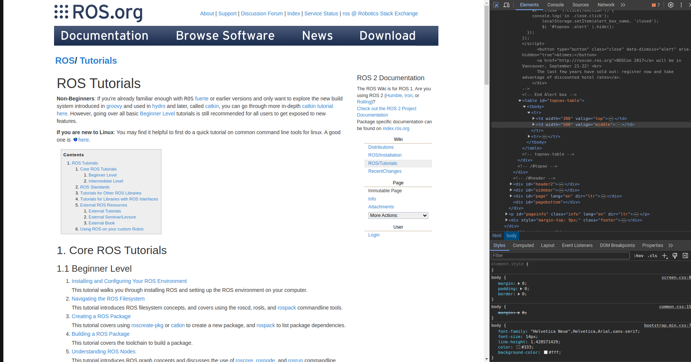
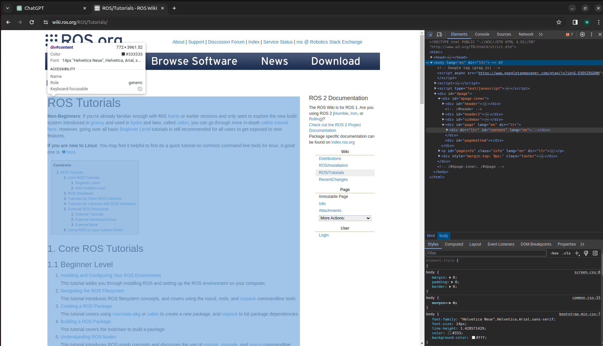

# scrapper
- We have scraper for different formats.
  1) Mardown
  2) Rst
  3) Plain
- What a scrapping tool does in general is it converts a particullar page of a document into a tree structure accordingly to it's heading levels.
```
(Table of Contents)
Quick start package installation (h1)
--Before you begin (h2)
----Windows (h3)
----Linux (h3)
--CARLA installation (h2)
----A. Debian CARLA installation (h3)
----B. Package installation (h3)
--Import additional assets (h2)
--Install client library (h2)
----CARLA versions prior to 0.9.12 (h3)
----CARLA 0.9.12+ (h3)
--Running CARLA (h2)
------Command-line options (h4)
--Updating CARLA (h2)
--Follow-up (h2)
```
- Each segment would be the path from the root to the leaf node.
  - For example, the path to the node Linux would be `(h1) Quick Start Package Installation -> (h2) Before You Begin -> (h3) Linux`.
  - The purpose of grouping the documents in this tree structure is to allow the embedding model to understand the relationship between the headers. If the embedding model is only given the content of `(h3) Linux`, it would not know what it is related to nor how we get to the point `(h3) Linux`. By adding the segments from previous headers, it becomes complete information that explains: this information is about "installation", then continues with "steps you need to do before you begin", and how you begin in "Linux". 
## Folders for scraper
- In every scraping folder, there will be a code called `scrape.py` that is the place you will use to scrape your documents. 
  - `scrape.py` will scrape the documents from the root url recursively until the entire website is scraped.  
- `Scraper_header`:  
- Use this folder if you want to scrape a website that has a headers and contents.
  In order to use this folder you need edit some variables accordingly to your needs:
  ```
  # TODO
  url = "https://wiki.ros.org/ROS/Tutorials/"
  root = "https://wiki.ros.org/ROS/Tutorials/"
  root_regex = r"^https://wiki.ros.org/ROS/Tutorials/"
  root_filename = "ROS"
  content_tags = [
    ('div', {'id': 'page', 'lang': 'en', dir: 'ltr'})
  ]
  ```
  - `url`: the url where your webside starts
  - `root`: the url where you want your website to recurse until
  - `root_regex`: the format of the url that it needs to follow
  - `root_filename`: the filename you want to store all your data
  - `content_tags`: the tags that you want to scrape
    - content_tags will be slightly confusing to find I will give the step by step process to find this.
      1) Go to the website you want to scrape
      2) For Linux and Windows press `Ctrl + Shift + C` and for Mac press `Command + Option + I`  
           
         You will se something like this.
      3) Now hover your cursor to the part where you want to scrape the content and click onto it.  
         
      4) Notice that the tag name of the content is `<div id="page" lang="en" dir="ltr">`.  
         So now you just need to paste the tag into `content_tags` accordingly to the format.  
         Format:```(<tag_type>, {<tag_attribute>:<tag_attribute_value>, ...other_attributes and attribute values })```
      5) In this case <tag_type> = div, <tag_attribute> = id, <tag_attribute_value> = page, etc.
      6) So the final result would be `('div', {'id': 'page', 'lang': 'en', dir: 'ltr'})`

         
- `Scraper_md`:
  In order to use this folder you need to provide the url to the folder of mkdocs.yaml of the repo.  
  `url="https://github.com/carla-simulator/carla/blob/master/mkdocs.yml"`
- `Scraper_rst`:
  In order to use this folder you will need to edit some variables accordingly to your needs
  ```
  mkdir('numpy')
  os.chdir('numpy')
  starting='index'
  url=f"https://github.com/numpy/numpy/blob/main/doc/source/index.rst?plain=1"
  ```
  - mkdir and os.chdir is just setting your directory name
  - `starting`: the name of your first rst file. (It's usually index)
  - `url`: the url to the index.rst of the repo. Notice you have to add `?plain=1` to the end of the url as that obtains th raw code of the rst file. 
