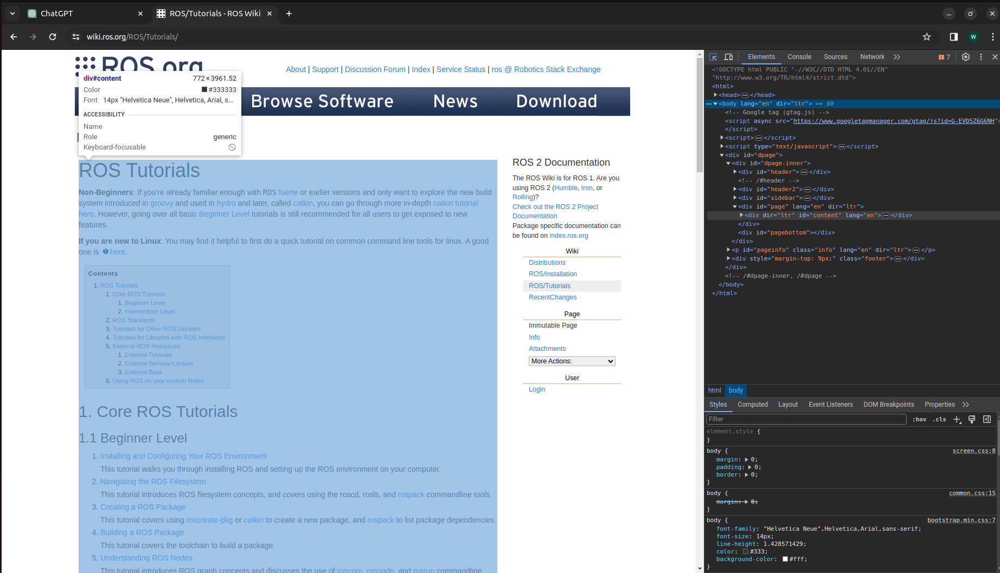

# Scrape_header
- Use this folder if you want to scrape a website that has a headers and contents.
  In order to use this folder you need edit some variables accordingly to your needs:
  ```
  # TODO
  url = "https://wiki.ros.org/ROS/Tutorials/"
  root = "https://wiki.ros.org/ROS/Tutorials/"
  root_regex = r"^https://wiki.ros.org/ROS/Tutorials/"
  root_filename = "ROS"
  content_tags = [
    ('div', {'id': 'page', 'lang': 'en', dir: 'ltr'})
  ]
  ```
  - `url`: the url where your website starts
  - `root`: the url where you want your website to recurse until
  - `root_regex`: the format of the url that it needs to follow
  - `root_filename`: the filename you want to store all your data
  - `content_tags`: the tags that you want to scrape
    - content_tags will be slightly confusing to find I will give the step by step process to find this.
      1) Go to the website you want to scrape
      2) For Linux and Windows press `Ctrl + Shift + C` and for Mac press `Command + Option + I`  
           
         You will se something like this.
      3) Now hover your cursor to the part where you want to scrape the content and click onto it.  
         
      4) Notice that the tag name of the content is `<div id="page" lang="en" dir="ltr">`.  
         So now you just need to paste the tag into `content_tags` accordingly to the format.  
         Format:```(<tag_type>, {<tag_attribute>:<tag_attribute_value>, ...other_attributes and attribute values })```
      5) In this case <tag_type> = div, <tag_attribute> = id, <tag_attribute_value> = page, etc.
      6) So the final result would be `('div', {'id': 'page', 'lang': 'en', dir: 'ltr'})`

- After you have set up the variables you can run `python3 scrape.py` and it will start scraping the website.