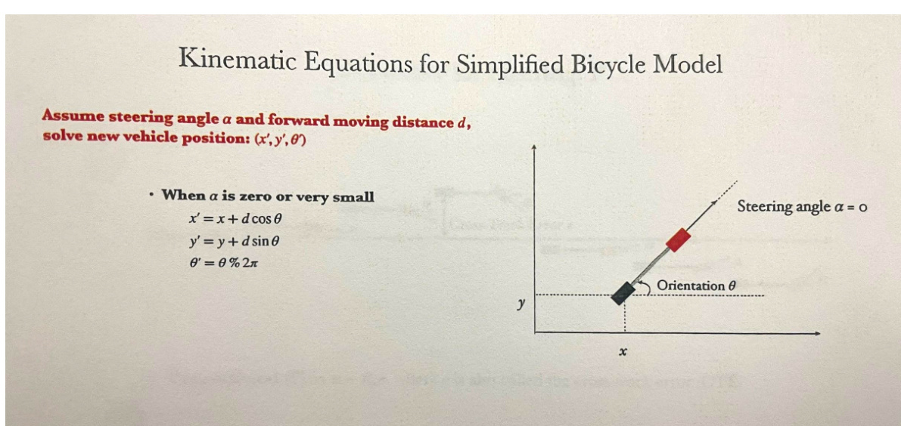
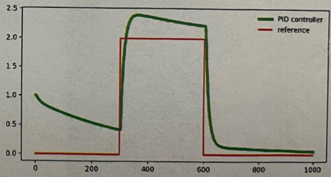

# Autonomous Driving  

Intro to Autonomous Driving  

(See slides for History of the Transportation Industry $^+$ Milestones in Vehicle Autonomy)  

Brief History of the Transportation Industry  

  

# Milestones in Vehicle Autonomy  

Milestones in Vehicle Autonomy  

  

  

Lvl 0: no automation The human driver is fully in control  

Lvl 1: driver assistance  

Alerts the driver to dangers, or intervenes briefly by performing simple maneuver   
E.g. cruise control   
E.g. automatic reverse braking  

Lvl 2: supervised occasional self-driving The human still has to sit in the car Most of the time the human driver is in control In some cases the car can take control and drive autonomously E.g. it parks the car while you are in the driver’s seat  

Lvl 3: limited self-driving $\rightarrow$ The vehicle is in full control in some situations Most of the time the car can drive autonomously BUT the driver will have to take control of the car at some point E.g. the car can go park  

# Lvl 4: full self-driving under certain conditions  

Conditions $\rightarrow$ usually $=$ approved driving within certain areas   
There is no wheel, since there does not have to be a driver   
BUT it is geofenced $\rightarrow$ the car can only do autonomous driving in an approved   
area   
E.g. waymo  

Lvl 5: full self-driving  

The car can use autonomous driving to travel anywhere with no human intervention  

# System Architecture for Autonomous Driving  

  

For ROAR competition NO environment perception $^+$ NO human user command input  

# Sensor Input  

Spatial Sensing:  

Short distance: ultrasound   
Midrange distance: 3D depth camera $^+$ LIDAR   
Long Distance: RGB Camera  

Global Position: GPS System  

Vehicle State Sensing:  

Motor speed sensor Wheel speed sensor Steering servo sensor Inertial measurement unit (IMU)  

# Environment Mapping and Perception  

Environment Mapping: 3D localization  

Road condition mapping: road, scenes, lanes  

Environment Perception:  

Object detection & recognition Object tracking  

# Motion Planner  

Mission Planner  

Calculating the best route to travel long distance from point A to point B E.g. Turn to get to destination  

Behavior Planner  

Vehicle safety monitoring   
Determines real-time vehicle behaviors: overtake, stop, following, on/off ramp, etc.   
E.g. How the vehicle will turn (slow down, steer, etc.)  

Local Planner  

Based on the mission planner and behavior planner –. Sets targets for immediate waypoints, speed, acceleration, and steering E.g. Step by step how to turn from the vehicle’s current position  

# Controller  

Longitudinal (Speed) Control Control vehicle motor’s speed and acceleration Equivalent to driver adjusting acceleration and braking   
Lateral (Steering) Control Control vehicle steering and orientation Equivalent to driver adjusting the steering wheel  

Popular control algorithms  

Pure Pursuit Control PID (Proportional-Integral-Derivative) Control MPC (Model-Predictive Control  

# PID Control  

A PID (Proportional-Integral-Derivative) controller is a control system that uses feedback to regulate process variables by continuously adjusting the output to match a desired setpoint.  

Drive $\rightarrow$ just means to change the state of some system  

# Modeling Robot Kinematics in DoF  

A rigid-body motion has 6 degrees of freedom in 3D space $(\mathrm{x},\mathrm{y},\mathrm{z},\alpha,\beta,\gamma)$  

Note: going back $\&$ forth $\rightarrow$ only 1 degree of freedom (bc its moving along one axis)  

$\alpha,\beta,\gamma\rightarrow$ represent turning along each x, y, z axis Represents: pan, tilt, roll  

Note: turning right $\&$ left is similarly only 1 degree of freedom (bc its turning along one axis)  

  
Six axes of translation and rotation  

Robots that are modeled as rigid body and have 6 DoF:  

Quad-rotor helicopters Fixed-wing airplanes Underwater vehicles  

Q: How many DoF does BB-8 or R2D2 have? $\rightarrow5$ (everything except flying/jumping up) A rolling ball on the surface has five DoF  

Planar Movement: $(\mathsf{x},\mathsf{y})$   
Planar Rotation: $\gamma$   
Body Pitch: $\beta$   
Body Roll: $\alpha$  

  

Q: How many DoF of the human arm?  

3 DoF at the Shoulder 2 DoF at the Elbow 2 DoF at the Wrist $\Rightarrow$ Total 7 DoF  

  
Figure 1. The DOF configuration of the humanoid arm TABLEI THE RANGE OF MOTION OF EACH DOF  

# Four-Wheel Ground Vehicle Model  

# Basic Four-Wheel Vehicle Model  

Driving wheels at the rear   
Steering wheels at the front   
3 DoF constrained on the ground surface: (x, y, θ) Can only pan right $\&$ left  

-​ Having full control of all these DoF $\rightarrow$ means we have achieved autonomous driving (Even tho the vehicle can tilt, like when going up a hill $\rightarrow$ the vehicle itself isn’t exactly controlling the tilt )  

Simplified Bicycle Model (simple way to think of vehicles’ DoF) Four wheels simplified to two bicycle  

Vehicle center of mass at the center of the rear wheel: (x, y)   
Wheel-to-wheel length: L   
Orientation along the length-L body: θ   
Steering angle: $\alpha$  

  

Note:  

Center of mass $\rightarrow$ at the rear wheel $\rightarrow\infty$ that's where we measure θ from -​ $\alpha$ just represents where we steer from (unlike θ, it's not a state/DoF) Rear-wheel drive, front-wheel steering -​ $\rightarrow\mathtt{B c}$ the acc path of the turn is followed by the rear wheels, while the front wheels are free to turn (bc of steering angle $\alpha$ )  

# Kinematic Equations for Simplified Bicycle Model Moving forward:  

  

d is total distance $({\mathsf{d}}={\mathsf{v t}})$  

When $\alpha$ is zero or very small:  

$\begin{array}{l}{\mathbf{x}^{\prime}=\mathbf{x}+\mathrm{dcos}\theta}\ {\mathbf{y}^{\prime}=\mathbf{y}+\mathrm{dsin}\theta}\ {\mathbf{\theta}^{\prime}=\mathbf{\theta}\mathbf{\%}2\pi}\end{array}$  

The red front wheels $\rightarrow$ shows new position x’, y’, θ’  

# Turning:  

  

# When a is significant  

Turning radius: $R={\frac{L}{\tan\alpha}}$ Angular velocity: ${\dot{\theta}}={\frac{\nu}{R}}$ .Turn (radian): $\beta=\frac{\nu t}{R}=\frac{d}{R}$  

Bc of the turning radius equation $\rightarrow$ longer vehicles $\rightarrow$ have to move their wheels further   
away to make a big turn If $\alpha$ is big (you turn ur wheel a lot) $\rightarrow$ you can make a small turn   
$\alpha\rightarrow$ static   
$\beta\rightarrow$ represents how much you turn (not static, increases as you keep traveling through   
the turn) ​ $\beta$ is the total travel distance/R  

·Rotation center $(x_{c},y_{c})$ $\begin{array}{r}{x_{c}=x-R\sin\theta}\ {y_{c}=y+R\cos\theta}\end{array}$  

Just use trig  

New coordinates $(x^{\prime},y^{\prime},\theta)$ $\begin{array}{l}{x^{\prime}=x_{c}+R\sin(\theta+\beta)}\ {y^{\prime}=y_{c}-R\cos(\theta+\beta)}\ {\theta^{\prime}=(\theta+\beta)\%2\pi}\end{array}$  

Add $\beta$ to $\uptheta\rightarrow\up b\upalpha$ we are turning $\beta$ (radians)  

# PID Controller: Tracking Preset Trajectories $\mathsf{K}_{\mathsf{p}}\to$ coefficient you choose  

# Controller for Steering P  

  

Multiply the error (the difference from where u want to be) $\rightarrow$ by a coefficient you choose $(\mathsf{K}_{\mathsf{p}})$ to reduce the error  

BUT problem:  

  

# Controller for Steering PD  

# Controller for Steering:PD  

Proportional-Derivative (PD)  

$$
\begin{array}{l}{{\alpha=-K_{p}e-K_{d}\Delta e,}}\ {{\Delta e=e(t)-e(t-1)}}\end{array}
$$  

P term:Directly compensate CTE D term: Compensate the rate of change in the CTE, smoothing out the trajectory when the value is close to the target  

  

D for derivative   
$\alpha\rightarrow$ takes into account the change in the $\mathsf{K}_{\mathsf{p}}\mathsf{e}$   
P term: Directly compensates CTE (cross track error)   
D term: Compensates the rate of change in the CTE, smoothing out the trajectory when the   
value is close to the target I.e. If the error is decreasing rapidly, D control will reduce the corrective action, preventing overshoot.  

Controller for Steering PID  

Problem:  

  

Systematic errors (like car misalignment) arise $\rightarrow$ shown by the bias If the car is slightly misaligned $\rightarrow$ the error will accumulate over time  

# Controller for Steering: PID  

Proportional-Integral-Derivative (PID)  

$$
\alpha=-K_{p}e-K_{d}\Delta e-K_{i}\sum e
$$  

I term: If system bias exists, the I term will compensate based on the sum of all past errors  

PID Controller Summary: ·Input: error signal e Control coefficients: K,Ka,K;  

  

I for integral   
Mechanism: The integral term accumulates the error over time, meaning that even a small, persistent error will add up.   
As the integral of the error grows (i.e. if we’ve been going to the wrong dir for a long time), it produces an increasing corrective action until the error is driven to zero.  

# Speed Control of DC Motor  

  

# Cruise Control using PID Algorithm  

Cruise Control using PID Algorithm  

Assume therc cxists systematic error in EsC calibration or cnvironmcntal crror caused by slippery ground conditions:  

Given a reference specd $\nu_{0}$ and mcasured spcedv $e=\nu_{0}-\nu^{\prime}$  

A PID controller for maintaining spccd vo: u=Ke+Ke+K;e  

P:Reduce thc rcsponsc ime for crror magnitude in spced I:Reduce the stcady state crror,making motor specd close to the refcrcnce speed D:Rcducc settling timc and overshoot  

  

PID can applied to controlling anything Very simple calculations  

# PID_Control.py  

## This is course material for Introduction to Modern Artificial Intelligence   
## Example code: PID_control.py   
## Author: Allen Y. Yang   
##   
## (c) Copyright 2020. Intelligent Racing Inc. Not permitted for commercial use   
import random   
import numpy as np   
import matplotlib.pyplot as plt   
class Vehicle2D(object): def __init__(self, length=10.0): """ Creates 2D vehicle model and initializes location (0,0) & orientation 0. """ self.x = 0.0 self.y = 0.0 self.orientation = 0.0 self.length = length self.steering_noise = 0.0 self.distance_noise = 0.0 self.steering_drift = 0.0 def set(self, x, y, orientation): """ Sets the vehicle coordinates and orientation. """ self.x = x self.y = y self.orientation = orientation % (2.0 \* np.pi) def set_noise(self, steering_noise, distance_noise): """ Sets the noise parameters. """ # makes it possible to change the noise parameters self.steering_noise = steering_noise self.distance_noise = distance_noise def set_steering_drift(self, drift): """  

<html><body><table><tr><td>II!I self.steering_drift = drift</td></tr><tr><td>def move(self, steering, distance, tolerance=0.001, max_steering_angle=np.pi , 4.0): I steering = front wheel steering angle, limited by max_steering_angle(max 90 degree) distance = total distance driven, most be non-negative</td></tr><tr><td>I if max_steering_angle >np.pi/2: raise ValueError("Max steering angle cannot be greater than 90-degree.") if steering > max_steering_angle: steering = max_steering_angle if steering -max_steering_angle:</td></tr><tr><td>steering = -max_steering_angle if distance < 0.0: distance = 0.0 # apply noise steering2 = random.gauss(steering, self.steering_noise) distance2 = random.gauss(distance, self.distance_noise)</td></tr><tr><td># apply steering drift steering2 += self.steering_drift # Execute motion turn = np.tan(steering2) * distance2 / self.length if abs(turn) < tolerance: # approximate by straight line motion</td></tr><tr><td>Self.x += distance2 * np.cos(self.orientation) self.y += distance2 * np.sin(self.orientation) self.orientation = (self.orientation + turn) % (2.0 * np.pi) else: # approximate bicycle model for motion radius = distance2 / turn Cx = self.x - (np.sin(self.orientation) * radius) cy = self.y + (np.cos(self.orientation) * radius) self.orientation = (self.orientation + turn) % (2.0 * np.pi)</td></tr></table></body></html>  

  

targets.append([i, 0]); track_x.append(i); track_y.append(0) for i in range(300,600): targets.append([i, 2]); track_x.append(i); track_y.append(2) for i in range(600,track_length): targets.append([i, 0]); track_x.append(i); track_y.append(0) # Set the parameters for K_p, K_d, and K_i K_p = 0.2; K_d = 3; K_i = 0.0005 x_trajectory, y_trajectory = vehicle.run_PID(targets, K_p, K_d, K_i, track_length) n = len(x_trajectory) controller_legend = 'PID controller' if K_p!=0 and K_d!=0 and K_i!=0 else 'PD controller'\ if K_p!=0 and K_d!=0 else 'P controller' if K_p!=0 else 'unknown controller' fig, ax1 = plt.subplots(1, 1, figsize=(8, 4)) ax1.plot(x_trajectory, y_trajectory, 'g', linewidth=4, label= controller_legend) ax1.plot(track_x, track_y, 'r', label='target') plt.legend() plt.show()  

# Example Cartpole Exercise  

## This is course material for Introduction to Modern Artificial Intelligence   
## Example code: cartpole_dqn.py   
## Author: Allen Y. Yang   
##   
## (c) Copyright 2020-2024. Intelligent Racing Inc. Not permitted for commercial use   
Please make sure to install openAI gym module   
pip install gym==0.17.3   
pip install install pyglet==1.5.29  

import gym import time  

PID control parameters Kp = 1.0 # Proportional gain Ki = 0.0 # Integral gain Kd = 0.5 # Derivative gain  

  